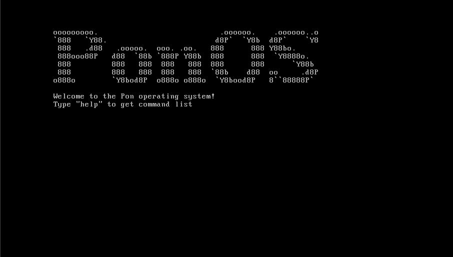

<div align="center">

```
ooooooooo.                           .oooooo.    .oooooo..o 
`888   `Y88.                        d8P'  `Y8b  d8P'    `Y8 
 888   .d88   .ooooo.  ooo. .oo.   888      888 Y88bo.      
 888ooo88P'  d88' `88b `888P'Y88b  888      888  'Y8888o.   
 888         888   888  888   888  888      888      'Y88b  
 888         888   888  888   888  `88b    d88' oo     .d8P 
o888o        `Y8bod8P' o888o o888o  `Y8bood8P'  8""88888P'  
```

# 🎯 PonOS

**Экспериментальная операционная система на чистом ассемблере**

[](https://github.com/Fl1riX/PonOS)
[](LICENSE)
[](https://github.com/Fl1riX/PonOS)
[](https://github.com/Fl1riX/PonOS)
[](https://github.com/Fl1riX/PonOS)

[Возможности](#-возможности) • [Быстрый старт](#-быстрый-старт) • [Архитектура](#-архитектура) • [Разработка](#-разработка) • [Roadmap](#-roadmap)

</div>

---

## 📖 О проекте

**PonOS** — это образовательная операционная система, написанная полностью на ассемблере x86. Проект демонстрирует фундаментальные принципы работы ОС на самом низком уровне: от загрузчика MBR до командной строки с обработкой ввода.

### 🎓 Образовательные цели

- Глубокое понимание архитектуры x86
- Прямая работа с BIOS прерываниями
- Управление памятью и регистрами процессора
- Создание загрузчиков и ядра ОС
- Низкоуровневое программирование без абстракций

---

## ✨ Возможности

### 🚀 Система загрузки

- **Двухэтапный загрузчик** с MBR (Master Boot Record)
- **Поддержка LBA** (Logical Block Addressing) с автоматическим fallback на CHS
- **Умное чтение диска** с повторными попытками и обработкой ошибок
- **Информативные сообщения** на каждом этапе загрузки
- **Загрузка ядра** в защищенную область памяти (0x1000)

### 💻 Пользовательский интерфейс

- Текстовый режим **80x25** символов
- Стильный **ASCII-баннер** при запуске
- Интерактивная **командная строка** с промптом `PON>`
- Полноценная **обработка клавиатуры** через BIOS INT 16h

### ⌨️ Система ввода

| Функция | Описание |
|---------|----------|
| **Буфер** | 254 символа с автоматической очисткой |
| **Backspace** | Корректное удаление с управлением курсором |
| **Enter** | Обработка команд с парсингом |
| **Overflow protection** | Автоматическая очистка при переполнении |

### 🛠️ Доступные команды

```bash
help    # Список всех команд
clear   # Очистка экрана
reboot  # Перезагрузка системы
calc    # Калькулятор (в разработке)
```

---

## 🚀 Быстрый старт

### Требования

- **NASM** (Netwide Assembler) 2.14+
- **QEMU** или другой эмулятор x86
- **Bash** для выполнения скриптов

### Установка зависимостей

```bash
# Ubuntu/Debian
sudo apt install nasm qemu-system-x86

# Arch Linux
sudo pacman -S nasm qemu

# macOS
brew install nasm qemu
```

### Сборка и запуск

```bash
# Клонирование репозитория
git clone https://github.com/Fl1riX/PonOS.git
cd PonOS

# Сборка проекта
chmod +x build.sh
./build.sh

# Система автоматически запустится в QEMU
```

### Ручная сборка

```bash
# Сборка загрузчиков и ядра
nasm -f bin bootloader/mbr.asm -o mbr.bin
nasm -f bin bootloader/boot.asm -o boot.bin
nasm -f bin kernel.asm -o kernel.bin

# Создание образа диска
cat mbr.bin boot.bin kernel.bin > os.bin

# Запуск
qemu-system-i386 -drive format=raw,file=os.bin
```

---

## 🏗️ Архитектура

### Карта памяти

```
┌─────────────────────────────────────┐
│ 0x00000 - 0x003FF  │ Таблица векторов прерываний │
│ 0x00400 - 0x004FF  │ BIOS Data Area               │
│ 0x00500 - 0x07BFF  │ Свободная память             │
│ 0x07C00 - 0x07DFF  │ MBR Загрузчик (512 байт)    │
│ 0x07E00 - 0x07FFF  │ Стек                         │
│ 0x08000 - 0x083FF  │ Второй загрузчик (1024 байт) │
│ 0x10000 - 0x107FF  │ Ядро системы (2048 байт)     │
│ 0x10800+           │ Свободная память             │
└─────────────────────────────────────┘
```

### Структура проекта

```
PonOS/
├── 📁 bootloader/
│   ├── mbr.asm           # Первый загрузчик (512 байт)
│   └── boot.asm          # Второй загрузчик (1024 байт)
├── 📄 kernel.asm         # Основное ядро системы
├── 📄 calculator.asm     # Модуль калькулятора
├── 🔧 build.sh          # Скрипт автоматической сборки
├── 📋 CHANGELOG.md      # История изменений
├── 📜 LICENSE           # MIT License
└── 📖 README.md         # Документация
```

### Процесс загрузки


1. **BIOS** загружает MBR в память по адресу 0x7C00
2. **MBR** загружает второй загрузчик в 0x8000
3. **Boot loader** проверяет поддержку LBA и загружает ядро
4. **Kernel** инициализирует видеорежим и запускает командную строку

---

## 🎨 Скриншоты


### Главное меню


### Список команд
*Скриншот команды `help` будет добавлен*

### Калькулятор
*В разработке*

</div>

---

## 🔧 Разработка

### Архитектура кода

#### Основные компоненты ядра

```asm
kernel_start:         # Точка входа
  ├── Инициализация видеорежима
  ├── Вывод баннера
  └── read_keyboard   # Основной цикл ввода
      ├── check_pointer      # Управление промптом
      ├── обработка клавиш   # Backspace, Enter, символы
      └── check_command      # Парсинг и выполнение команд
```

#### Система команд

- **Парсинг**: Посимвольное сравнение через `str_cmp`
- **Буфер**: Статический массив на 254 байта
- **Команды**: Таблица строк с нулевым терминатором

### Отладка

```bash
# Запуск с отладчиком GDB
qemu-system-i386 -s -S -drive format=raw,file=os.bin

# В другом терминале
gdb
(gdb) target remote localhost:1234
(gdb) break *0x7c00
(gdb) continue
```

---

## 📊 Статистика проекта

<div align="center">

| Метрика | Значение |
|---------|----------|
| Строк кода | ~400+ |
| Размер MBR | 512 байт |
| Размер загрузчика | 1024 байт |
| Размер ядра | 2048 байт |
| Языков | 1 (Assembly) |
| Зависимостей | 0 |

</div>

---

## 🤝 Участие в разработке

Проект открыт для любых предложений! Вы можете помочь:

### 🐛 Сообщить об ошибке
Создайте [Issue](https://github.com/Fl1riX/PonOS/issues) с описанием проблемы

### 💡 Предложить идею
Поделитесь своими мыслями в [Discussions](https://github.com/Fl1riX/PonOS/discussions)

### 🔧 Внести код
1. Fork репозитория
2. Создайте ветку (`git checkout -b feature/amazing-feature`)
3. Commit изменений (`git commit -m 'Add amazing feature'`)
4. Push в ветку (`git push origin feature/amazing-feature`)
5. Откройте Pull Request

### 📝 Улучшить документацию
Любые улучшения README, комментариев или wiki приветствуются!

---

## 📚 Ресурсы для изучения

- [OSDev Wiki](https://wiki.osdev.org/) - Энциклопедия разработки ОС
- [NASM Documentation](https://www.nasm.us/xdoc/2.15.05/html/nasmdoc0.html)
- [x86 Assembly Guide](https://www.cs.virginia.edu/~evans/cs216/guides/x86.html)
- [BIOS Interrupts](http://www.ctyme.com/intr/int.htm)

---

## 📜 Лицензия

Проект распространяется под лицензией **MIT License**.

```
MIT License

Copyright (c) 2025 Fl1riX

Permission is hereby granted, free of charge, to any person obtaining a copy
of this software and associated documentation files (the "Software"), to deal
in the Software without restriction, including without limitation the rights
to use, copy, modify, merge, publish, distribute, sublicense, and/or sell
copies of the Software, and to permit persons to whom the Software is
furnished to do so, subject to the following conditions:

The above copyright notice and this permission notice shall be included in all
copies or substantial portions of the Software.
```

Полный текст лицензии: [LICENSE](LICENSE)

---

## 🙏 Благодарности

Особая благодарность:

- **OSDev Community** за бесценные знания и документацию
- **NASM Team** за отличный ассемблер
- **QEMU Project** за надежный эмулятор
- Всем, кто интересуется низкоуровневым программированием

---

## 📞 Контакты

**Автор**: Fl1riX  
**GitHub**: [@Fl1riX](https://github.com/Fl1riX)  
**Проект**: [PonOS](https://github.com/Fl1riX/PonOS)

---

<div align="center">

**⭐ Если проект вам понравился, поставьте звезду!**

Made with ❤️ and Assembly

[](https://github.com/Fl1riX/PonOS)
[](https://github.com/Fl1riX/PonOS)

</div>